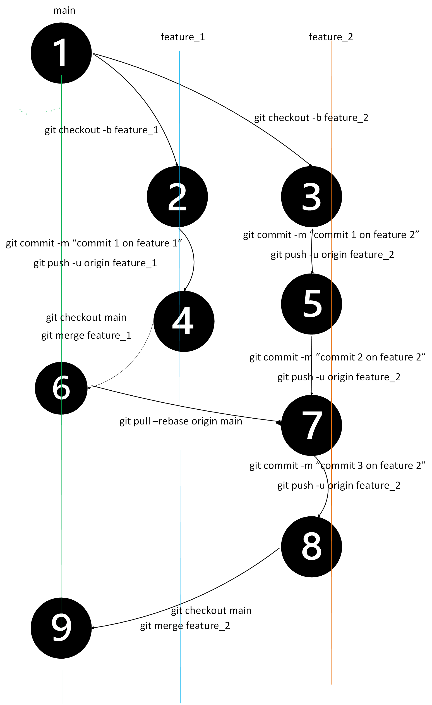

# MOTI Coding Style Guide

This document is to provide a basic guideline of coding styles that should be followed by developers when contributing to MOTI source code.

There are several things that we are considering when defining the coding style for MOTI projects:

- Consistency: A consistent coding style makes it easier to read and understand code, as it reduces the need to decipher unfamiliar or inconsistent conventions.

- Readability: Choose coding conventions that make the code easy to read and understand, such as using meaningful names for variables and functions, and using appropriate white space and indentation.

- Maintainability: Consider how the coding style will impact the maintainability of the code, including how easy it will be to make changes and add new features in the future.

- Team preferences: Take into account the preferences of the team members working on the project, as having a coding style that is familiar and comfortable for them can help increase productivity.

- Industry standards: Consider any industry-specific standards or best practices that should be followed.

- Tools: Consider how the coding style will work with any tools that will be used with the code, such as linters and code formatters.

- Project goals: Consider the goals of the project and how the coding style can support or hinder those goals.

In order to help developers write code in a consistent way, we recommend that developers follow the widely accepted style guides listed below.

- [C# Style Guide](https://google.github.io/styleguide/csharp-style.html)
- [.NET Standard](https://github.com/dotnet/standard)
- [.NET Naming Guidelines](https://learn.microsoft.com/en-us/dotnet/standard/design-guidelines/naming-guidelines)
- [Java Style Guide](https://google.github.io/styleguide/javaguide.html)
- [Python Style Guide](https://google.github.io/styleguide/pyguide.html)
- [Clean Code PHP](https://github.com/jupeter/clean-code-php)
- [JavaScript Style Guide](https://google.github.io/styleguide/jsguide.html)
- [TypeScript Style Guide](https://google.github.io/styleguide/tsguide.html)
- [Shell Style Guide](https://google.github.io/styleguide/shellguide.html)
- [HTML/CSS Style Guide](https://google.github.io/styleguide/htmlcssguide.html)
- [JSON Style Guide](https://google.github.io/styleguide/jsoncstyleguide.xml)
- [XML Document Format Style Guild](https://google.github.io/styleguide/xmlstyle.html)

## Copyright and license

All code committed in repositories must be licensed under the Apache License, Version 2.0, or a compatible license (LGPL 2.1, Eclipse, CDDL) if importing code with a third-party copyright.

## Development Environment

### Git
Git branch work flow:

- [Git & GitHub made Simple Branching and PR](https://dev.to/didof/git-github-made-simple-branching-and-pr-37l9)
- [Git Style Guide](https://github.com/agis/git-style-guide)
- [Rules from Git Documentation](https://github.com/git/git/blob/master/Documentation/CodingGuidelines)

### PowerShell
- [The PowerShell Best Practices and Style Guide](https://github.com/PoshCode/PowerShellPracticeAndStyle)

### Shell
- [Shell Style Guide](https://google.github.io/styleguide/shellguide.html)

### Docker and Kubernetes
- [Kubernetes Configuration Best Practices](https://learn.microsoft.com/en-us/dotnet/standard/design-guidelines/naming-guidelines)
- [Best Practices for Writting Dockerfiles](https://docs.docker.com/develop/develop-images/dockerfile_best-practices/)
- [Docker Development Best Practices](https://docs.docker.com/develop/dev-best-practices/)

## Platforms

### Design in a REST API
- [OpenAPI Specification](https://swagger.io/specification/)
- [Microsoft REST API Guidelines](https://github.com/Microsoft/api-guidelines)- The Microsoft REST API Guidelines.
- [JSON API Recommendations](https://jsonapi.org/recommendations/)- This section contains recommendations for JSON API implementations.
- [API Security Checklist](https://github.com/shieldfy/API-Security-Checklist)- Checklist of the most important security countermeasures when designing, testing, and releasing your API.
- [Google Cloud API Design Guide](https://cloud.google.com/apis/design)- A general design guide for networked APIs provided by Google.

### Frontend Development
- [CSS Guidelines](https://cssguidelin.es/)- High-level advice and guidelines for writing sane, manageable, scalable CSS.
- [Frontend Guidelines](https://github.com/bendc/frontend-guidelines)- Some HTML, CSS and JS best practices.
- [Front-End Check List](https://github.com/thedaviddias/Front-End-Checklist)

### Node.js
- [Microsoft + Node.js Guidelines](https://github.com/Microsoft/nodejs-guidelines)
- [Node.js Style Guide](https://github.com/felixge/node-style-guide)

## Frameworks
- [Django Coding Style](https://docs.djangoproject.com/en/dev/internals/contributing/writing-code/coding-style/)
- [Vue Style Guide](https://vuejs.org/style-guide/)
- [React Engineering Handbook](https://engineering.hmn.md/standards/style/react/)

## Content Management
- [WordPress Coding Standards](https://developer.wordpress.org/coding-standards/wordpress-coding-standards/)
- [Druble Coding Standards](https://www.drupal.org/docs/develop/standards)
- [Magento Coding Standards](https://developer.adobe.com/commerce/php/coding-standards/)
- [Octobercms Developer Guide](https://octobercms.com/help/guidelines/developer)

## Database

### SQL
- [SQL Style Guide](https://www.sqlstyle.guide/)

### No-SQL
- [Mongo Style Guide](https://github.com/jsoendermann/MongoStyleGuide)

## Secure Coding
- [.NET Secure Coding Guidelines](https://learn.microsoft.com/en-us/dotnet/standard/security/secure-coding-guidelines)
- [WebAppSec/Secure Coding Guidelines](https://wiki.mozilla.org/WebAppSec/Secure_Coding_Guidelines)

## User Interface Guidelines
- [BC Government Design System](https://developer.gov.bc.ca/Design-System/About-the-Design-System)
- [U.S. Web Design Standards](https://designsystem.digital.gov/) - Open source UI components and visual style guide for U.S. government websites.

## Test
- [Software Testing Guidelines](https://www.softwaretestingmentor.com/guidelines-for-software-testing/)
- [Unit testing best practices with .NET Core and .NET Standard](https://learn.microsoft.com/en-us/dotnet/core/testing/unit-testing-best-practices)
- [A guide to unit testing in JavaScript](https://github.com/mawrkus/js-unit-testing-guide)

## Data and Configuration
- [Guide for Security-Focused Configuration Management of Information System](https://nvlpubs.nist.gov/nistpubs/SpecialPublications/NIST.SP.800-128.pdf)
